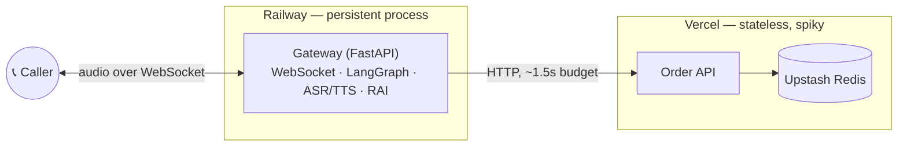
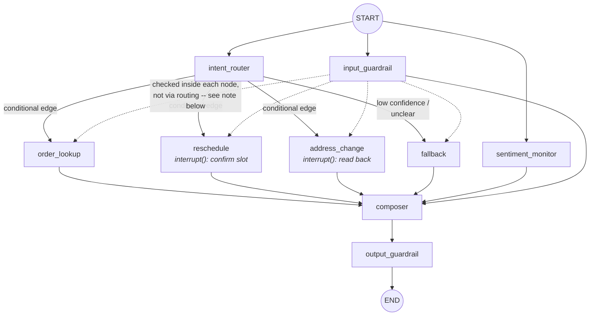
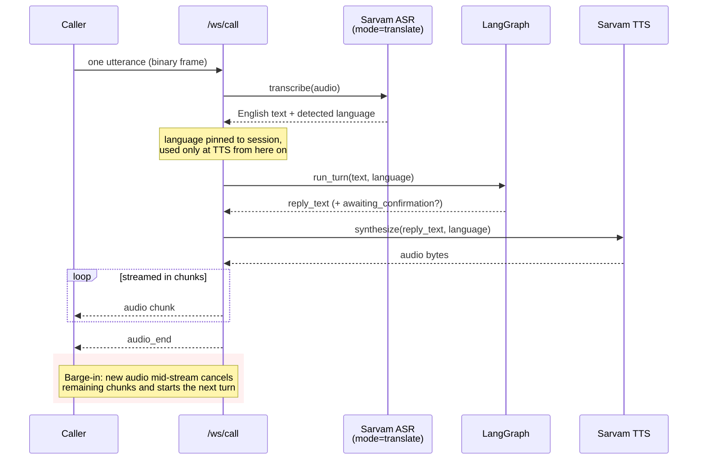

# Logistics & Delivery Voice Concierge

[](https://github.com/vishrutxraj/voice-concierge/actions/workflows/ci.yml)
[](https://www.python.org/downloads/release/python-3110/)
[](#licence)

A multilingual voice AI agent for delivery/logistics customer support.
Handles *"where is my order"*, rescheduling, and address correction across
Indian languages — and hands a frustrated caller to a human before they have
to ask twice.

Built API-first, so it runs identically on a laptop, in CI, and on Hugging
Face Spaces, with **no paid dependency required to run it.**

**Status: all 7 build phases complete.** 227 tests, zero API spend to run
any of them. See [Build phases](#build-phases) for what shipped when, and
[Evaluation results](#evaluation-results) for real numbers, not placeholders.

**Live, deployed right now** — the real split, not a demo stand-in:

| Service | URL |
|---|---|
| Gateway (Railway) | https://voice-concierge-production-83c5.up.railway.app |
| Order API (Vercel + Upstash) | https://voice-concierge-eta.vercel.app |

```bash
curl -s https://voice-concierge-production-83c5.up.railway.app/health
curl -X POST https://voice-concierge-production-83c5.up.railway.app/call/turn \
  -H 'Content-Type: application/json' \
  -d '{"session_id":"try-1","text":"where is my order","caller_phone":"9990000002"}'
```

This is a shared, live instance — writes (reschedule/address changes) persist
in the real Upstash-backed store and are visible to anyone hitting it, not a
private sandbox per visitor. Treat it like the demo it is.

---

## Contents

- [Why it's built this way](#why-its-built-this-way)
- [Architecture](#architecture)
- [The conversation graph](#the-conversation-graph)
- [The voice pipeline](#the-voice-pipeline)
- [Responsible AI](#responsible-ai)
- [Getting started](#getting-started)
- [Trying it out](#trying-it-out)
- [Deploying](#deploying)
- [Evaluation results](#evaluation-results)
- [Cost model](#cost-model)
- [Project layout](#project-layout)
- [Build phases](#build-phases)
- [Limitations](#limitations)
- [Licence](#licence)

---

## Why it's built this way

Four decisions drove everything else.

**1. Translate at the edge, reason in English.** Sarvam's `/speech-to-text`
endpoint with `mode=translate` (verified against current docs — the original
brief's `/speech-to-text-translate` is now legacy) returns English regardless
of what language the caller spoke. So the entire agent graph runs in English
only — no multilingual prompting, no per-language prompt tuning, no separate
evaluation of agent behaviour per language. Language is detected once at ASR,
pinned to session state, and used at exactly one place: the TTS node. This
deletes most of the complexity a multilingual agent normally carries.

**2. Never trust ASR for an order ID.** Whisper-class models run 25–35% WER
on Indic speech, worse on 8kHz telephony audio — and an alphanumeric ID is
the single worst thing to ask them for. So the agent never parses one: it
looks up the caller's open orders by phone number and fuzzy-matches the
transcript against that short list. Constraining the search space from 10¹⁰
to 3 turns an unsolved problem into a solved one. **This is the single most
important correctness decision in the project.**

**3. Split the deployment along the connection-lifetime seam.** Order
lookups are stateless and spiky — textbook serverless, so they run on
Vercel. The voice loop needs a persistent WebSocket and no useful execution
ceiling, which no serverless function offers, so the gateway runs on
Railway. The boundary is enforced *mechanically* — `test_module_is_liftable`
parses the AST and fails the build on any gateway import inside the order
API — and both `OrderClient` implementations are tested for byte-identical
behaviour, so "works locally" and "works deployed" are one claim, not two.

**4. PII is a layer, not a node.** Redaction sits between the agent and
every destination that persists anything — logs, traces, checkpoints. It
cannot be routed around. Toward the LLM, PII is *tokenized* rather than
destroyed, so the agent can still read an address back to confirm it; the
vault holding real values is in-memory, session-scoped, and explicitly
excluded from serialization.

---

## Architecture



Two services, one reason for the split: order lookups are stateless request/
response (serverless-shaped), the voice loop is a long-lived stateful
connection (container-shaped). `services/order-api/` has **zero imports**
from `services/gateway/`, checked mechanically in CI — swap the order store
for a real WMS and nothing on the gateway side changes.

---

## The conversation graph

Built on [LangGraph](https://github.com/langchain-ai/langgraph). Three nodes
run concurrently off `START` — a slow sentiment call or safety check can
never delay the caller hearing a reply — then the router dispatches to one
of four agents, all of which fan back into a single composer.



**Why `input_guardrail` doesn't gate the routing edge.** The dotted lines
above are deliberate, not a simplification: a LangGraph conditional edge
(`route_edge`, attached to `intent_router`'s own completion) does **not**
reliably see a concurrent sibling's write, even though both fan out from the
same `START` — confirmed the hard way, as a real bug during the build (a
self-harm message got routed straight into `order_lookup`). So each of the
four agent nodes checks `input_guardrail`'s verdict itself, as its first
line — by the time any of them runs, it's a later superstep, and the merged
state is guaranteed present as ordinary node input. That's the same
guarantee `composer` relies on to see all three of its concurrent
predecessors.

<details>
<summary><b>More on the concurrency model, interrupt()/resume, and other build-time gotchas</b></summary>

- `intent_router`, `sentiment_monitor`, and `input_guardrail` are independent
  nodes all fed from `START`; LangGraph runs them in the same superstep. That
  concurrency has one sharp edge: two nodes in the same superstep cannot
  write the same state key, or LangGraph raises `InvalidUpdateError` rather
  than silently picking a winner. Domain agents write `agent_reply`; only
  `composer` — which fans in after all three branches complete — writes the
  final `reply_text`. Hit this exact error once during the build; the fix
  (splitting the field) is now a regression test.
- `reschedule` and `address_change` both pause on `interrupt()` before
  writing anything — the caller hears the exact slot or address read back
  and must confirm before `OrderClient` is ever called. The next turn
  resumes via `Command(resume=...)`. Passing `resume=False` (a decline)
  needed its own fix: LangGraph treats a bare falsy resume value as "no
  input provided," so declines are wrapped as `{"confirmed": False}` and
  unwrapped at the interrupt site.
- Every node emits a trace event. `GET /api/sessions/{id}/explain` returns
  the full decision chain: what was chosen, how confident, what was
  rejected, and why.

</details>

---

## The voice pipeline

`/ws/call` wraps the exact same `run_turn()` the text endpoint uses — the
graph never changed to "support audio"; audio is a transport-layer concern
around it (`app/audio/`).



Barge-in is **generation fencing, not true preemption**: every inbound
utterance bumps a counter, and both the in-flight turn and the outbound
chunk loop check it after every await point, discarding a superseded turn's
output. `run_turn` runs synchronously on a worker thread, and Python cannot
forcibly cancel a running thread — so the correct move is fencing the
*output*, not trying to cancel the *work*.

<details>
<summary><b>Wire protocol and other audio details</b></summary>

```
client -> server
  {"type": "start", "session_id"?, "caller_phone"?}   -- once, first message
  <binary frame>                                       -- one whole utterance
  {"type": "hangup"}

server -> client
  {"type": "ready", "session_id": "..."}
  {"type": "transcript", "text": "...", "language": "hi-IN"}
  {"type": "reply", "text": "...", "intent": "...", "awaiting_confirmation": {...} | null}
  <binary frame> x N                                    -- streamed reply audio
  {"type": "audio_end"}   -- or {"type": "barge_in"} if new caller audio cut it short
```

`/ws/call` treats one inbound binary frame as one whole utterance — a
browser client does push-to-talk or its own silence detection and sends a
complete recording per turn, exactly what `ASRClient.transcribe()` expects.
No server-side VAD or true streaming ASR yet (see
[Limitations](#limitations)).

Try the TTS client standalone:

```python
from app.providers.tts_client import get_tts_client
result = get_tts_client().synthesize("Your order is out for delivery.")
# result.audio_bytes is real, playable WAV -- decoded from Sarvam's base64
# response, or a valid silent WAV from the mock if no SARVAM_API_KEY is set.
```

Or drive the whole thing over a real WebSocket — see
`tests/gateway/test_ws_endpoint.py` for a full example.

</details>

---

## Responsible AI

Not a bolt-on — each requirement maps to a specific, enforced mechanism.

| Requirement | Mechanism | Where |
|---|---|---|
| **Observability** | Structured JSON events for every node entry, tool call, LLM call, and decision. Langfuse is an optional mirror; local tracing works with zero credentials. | `app/observability/trace.py` |
| **Explainability** | `GET /api/sessions/{id}/explain` — per decision: choice, confidence, rejected alternatives, reasoning. | `app/main.py` |
| **Data privacy** | Irreversible redaction toward logs/disk; reversible tokenization toward the LLM. Vault is in-memory and non-serializable. Consent gate on persistence. | `app/observability/pii.py` |
| **Right to erasure** | `DELETE /api/sessions/{id}` plus time-bounded retention (`TRACE_RETENTION_HOURS`). | `app/observability/trace.py` |
| **Guardrails** | Deterministic keyword/phrase screening (self-harm, violence, illegal activity, prompt injection) on both the caller's input and the composed reply. Out-of-scope chit-chat is the router's own `fallback` bucket, unchanged since phase 2. | `app/guardrails/`, `app/graph/nodes/input_guardrail.py`, `output_guardrail.py` |
| **Bias & fairness** | A language-invariance regression check (router decision + sentiment score must be identical across language tags for the same English text — passes today) plus a manifest-based cross-language accuracy/sentiment comparison, honestly reported as no-real-corpus-yet. If Telugu callers were flagged frustrated more often than English ones at equal sentiment, that would be measurable bias in the escalation path. | `scripts/eval_fairness.py` |
| **Human-in-the-loop** | Confidence floor (`MIN_INTENT_CONFIDENCE`) escalates rather than guessing. Sentiment threshold and unresolved-turn ceiling both trigger handoff. Writes require `interrupt()` confirmation. | `app/graph/` |

Two properties worth stating plainly:

- **The test suite runs with zero credentials, always** — enforced by an
  autouse `conftest.py` fixture, not just convention. If a test needs a live
  API key, the test is wrong.
- **PII redaction is tested harder than the business logic.** A leak there
  is worse than a wrong delivery slot.

**Why keyword-based guardrails, not an LLM safety classifier:** a safety
check that only works with `GROQ_API_KEY` set would be silently absent in
exactly the configuration — local dev, CI — where it's easiest to forget to
re-verify it. The trade-off is real and stated up front: it catches
exact/near-exact phrasing and openly does not catch paraphrase,
code-switched, or deliberately obfuscated attempts.

Nothing here trains or fine-tunes a model — Sarvam and Groq are consumed
purely as hosted inference APIs. Every eval in this project measures how
well a pre-trained third-party model performs on this specific use case, the
same way you'd benchmark any vendor API before depending on it.

---

## Getting started

```bash
git clone <repo> && cd voice-concierge
cp .env.example .env          # works unfilled -- mocks cover every provider
pip install -r requirements-dev.txt
pytest -q                     # 227 tests, no network, no credentials
```

Gateway alone, in-process order client (fastest loop, what CI uses):

```bash
cd services/gateway && uvicorn app.main:app --reload --port 7860
# -> http://localhost:7860/ui   (Gradio test harness)
```

Both services, mirroring the deployed split:

```bash
docker compose up --build     # gateway :7860, order-api :8000
```

`conftest.py` wires the monorepo paths, so `pytest` at the root just works —
no editable installs.

---

## Trying it out

### The Gradio test harness

The fastest way to actually feel the agent work. Two tabs: a text chat that
behaves like a real caller typing instead of speaking (confirmation replies
are interpreted the same way a voice call interprets "yes"/"no" — see
`app/audio/confirmation.py` — not a permissive button), and an audio
playground for one-shot ASR → graph → TTS turns with real playback. Both
show the live explain trail alongside the conversation.

```bash
cd services/gateway && uvicorn app.main:app --reload --port 7860
# -> http://localhost:7860/ui
```

### Text conversation, via curl

```bash
curl -s -X POST localhost:7860/call/turn -H 'Content-Type: application/json' -d '{
  "session_id": "demo-1", "text": "reschedule to friday evening",
  "caller_phone": "9990000002"}'
# -> awaiting_confirmation: {"kind":"confirm_reschedule", "proposed_slot":"Friday...", ...}

curl -s -X POST localhost:7860/call/turn -H 'Content-Type: application/json' -d '{
  "session_id": "demo-1", "text": "yes", "resume": true}'
# -> reply_text: "Rescheduled to Friday..."

curl -s localhost:7860/api/sessions/demo-1/explain   # the decision trail
```

### The constraint logic

The seeded store models a real WMS, so refusals are real:

```bash
# Three open orders for one caller -- the fuzzy-matching search space
curl 'localhost:7860/api/orders?phone=9990000001'

# Slot saturated by four seeded orders -> refusal + alternatives
curl -X POST localhost:7860/api/orders/DLV1002/reschedule \
  -H 'Idempotency-Key: demo-1' -H 'Content-Type: application/json' \
  -d '{"new_date":"<today+3>","window":"morning"}'

# Already delivered -> TERMINAL_STATE
# Already rescheduled twice (DLV1006) -> RESCHEDULE_LIMIT
# Out for delivery, different city (DLV1001) -> OUT_FOR_DELIVERY_CITY_CHANGE
```

### Guardrails

```bash
curl -s -X POST localhost:7860/call/turn -H 'Content-Type: application/json' -d '{
  "session_id": "demo-2", "text": "I want to kill myself, where is my order",
  "caller_phone": "9990000002"}'
# -> reply_text mentions connecting you with a person immediately; escalated: true

curl -s localhost:7860/api/sessions/demo-2/explain
# -> guardrail_checks: [{"node": "input_guardrail", "verdict": "blocked",
#     "data": {"category": "self_harm", "matched_phrase": "kill myself"}}]
```

### The bias/fairness eval

```bash
python scripts/eval_fairness.py
```

Runs two checks: a language-invariance regression (the same English text
must produce an identical router decision and sentiment score regardless of
language tag — real, passing, no fixtures needed) and a cross-language
accuracy/sentiment corpus comparison (needs real data — see
[Evaluation results](#evaluation-results)).

---

## Deploying

```bash
# Order API -> Vercel
cd services/order-api && vercel --prod
#   then set UPSTASH_REDIS_REST_URL / _TOKEN in the project settings

# Gateway -> Railway
railway up
#   set ORDER_API_BASE_URL to the Vercel deployment URL
```

### Hugging Face Spaces (free-forever fallback)

```bash
# Create a Space (Docker SDK) on huggingface.co, then:
git remote add space https://huggingface.co/spaces/<you>/<space-name>
git push space main
```

`deploy/hf-space/README.md`'s frontmatter (`sdk: docker`, `app_port: 7860`)
is what Spaces reads to build `services/gateway/Dockerfile` — nothing extra
to configure there.

Two ways to run, both fully supported by the same image (choose via the
Space's **Settings → Repository secrets**):

1. **Self-contained, no secrets required.** Leave `ORDER_API_BASE_URL`
   unset — the gateway falls back to `InProcessOrderClient`, seeded with the
   same fixture data used locally and in CI. This is what makes "no paid
   dependency required" true for a Spaces demo, not just a laptop. Writes
   are in-memory and reset when the Space restarts — fine for a demo, not
   for anything real.
2. **Full split, matching production.** Deploy `services/order-api` to
   Vercel first and set `ORDER_API_BASE_URL` as a Space secret. Writes then
   actually persist via Upstash, matching the real Railway→Vercel topology.

Add `SARVAM_API_KEY`/`GROQ_API_KEY` as secrets for live speech and real
routing; leave them unset and it still runs entirely on mocks.

<details>
<summary><b>Verify with a real request, not just a green healthcheck — here's why that matters</b></summary>

`docker build` + `docker run` + `curl -X POST .../call/turn` locally (see
CI's `gateway-image` job for the exact commands) catches problems `/health`
alone won't. That's not hypothetical — it's exactly how a real bug was
caught while preparing this deployment: the image didn't bundle
`services/order-api`, so option 1 above 500'd on **every** order-touching
request despite `/health` reporting fine. `/health` never touches
`OrderClient`, so it stayed green through a completely broken demo path.
Fixed by bundling `order_api` into the image; CI's `gateway-image` job now
exercises a real `/call/turn` request too, not just `/health`.

</details>

---

## Evaluation results

### ASR (Sarvam `saaras:v3`, `mode=translate`, telephony-degraded)

Real numbers, run against `fixtures/audio/`'s 20 [Google FLEURS](https://huggingface.co/datasets/google/fleurs)
recordings (CC-BY-4.0, real human speech — see `fixtures/audio/README.md`
for sourcing) — 5 clips each in `hi-IN`, `ta-IN`, `te-IN`, `bn-IN`, scored
after an 8kHz mu-law round-trip:

| Language | Avg WER | Sample count |
|---|---|---|
| ta-IN | 47.4% | 5 |
| hi-IN | 55.9% | 5 |
| te-IN | 63.4% | 5 |
| bn-IN | 71.6% | 5 |

A 50%+ WER sounds like the system is barely working — that's not actually
what's happening here.

<details>
<summary><b>Why these numbers read worse than the translations actually are</b></summary>

- **This is translation WER, not transcription WER.** `mode=translate` asks
  Sarvam to translate speech into English; two independently fluent, fully
  correct translations of the same sentence can choose different words or
  word order, and WER against a single reference punishes that as if it
  were an error. Spot-checking the `hi-IN` results: reference *"Argentina is
  well known for having one of the best polo teams and players in the
  world"* vs. Sarvam's *"Argentina is known for its best polo team and
  players in the world"* — scores 35% WER and is a perfectly good
  translation. Some of the WER in this table is real translation drift (the
  same clip's raw output includes "the village of Kutuhal" where the
  reference reads "the intriguing village" — a genuine mistranslation of a
  descriptive word as a proper noun), but a meaningful chunk of it is this
  metric artifact, not actual failure.
- **5 samples per language is a smoke-sized sample, not a confident
  ranking.** These are real numbers, not placeholders, but they're
  indicative rather than decisive — no language should be cut from v1 on
  this alone. `fixtures/audio/README.md` explains how to add more languages
  or samples at roughly the same (very low) cost.
- Reproduce with `python scripts/eval_asr.py` (uses the content-hash cache,
  so repeat runs after the first are free) or `--provider mock` to
  sanity-check the pipeline for ₹0 (that mode's numbers are meaningless by
  design — see `fixtures/audio/README.md`).

</details>

### Bias/fairness

The language-invariance check in `scripts/eval_fairness.py` passes today —
router and sentiment scoring produce identical output regardless of
language tag, as architecturally required. The cross-language
accuracy/sentiment corpus half has no real data yet — FLEURS' general-domain
sentences don't help here (every one would trivially fall back as
out-of-scope, making "accuracy" meaningless); see `fixtures/fairness/README.md`
for what actually closing that gap needs.

---

## Cost model

Everything in the development loop is free. Live speech is the only spend,
and the content-hash cache makes even that spend mostly one-time.

| Component | Cost |
|---|---|
| Local dev, CI, all tests | ₹0 — no credentials needed |
| Vercel (order API, hobby) | ₹0 |
| Upstash Redis (free tier) | ₹0 |
| Railway | $5 trial / 30 days, then $5/mo Hobby |
| Hugging Face Spaces (gateway fallback) | ₹0, no expiry |
| Groq (LLM) | Free tier |
| Sarvam STT | ₹30/hour of audio |
| Sarvam TTS | Bulbul v2 ₹15/10k chars (dev) · v3 ₹30/10k chars (demo) |

A three-minute call costs roughly ₹4.50. Sarvam's ₹100 signup credit covers
~20 uncached calls — or several hundred in practice, because
`app/providers/cache.py` hashes every ASR/TTS request by content and writes
through to `data/cache/`. Replaying the same test phrase during development
costs money exactly once, ever; every call after that is a filesystem read.

Railway's trial is $5 for 30 days, then $5/month Hobby. Choosing SQLite over
Postgres for the checkpointer keeps the gateway to a single service, which
is what makes that tier sufficient — and HF Spaces is a free-forever
fallback on the same image if the budget disappears entirely.

---

## Project layout

```
packages/order-contracts/    pydantic schemas shared by both services
services/order-api/          Vercel function -- stateless, Upstash-backed
services/gateway/            Railway container -- WebSocket, LangGraph, RAI
  app/graph/                  router, 4 agents, composer, extraction
  app/audio/                  /ws/call: AudioTransport, call_loop, confirmation
  app/guardrails/              input/output moderation -- patterns.py, moderation.py
  app/ui/                      Gradio test harness, mounted at /ui
  app/providers/               OrderClient, LLMClient, ASRClient, TTSClient --
                                each a real implementation + a mock, selected
                                by whether credentials exist
  app/providers/cache.py       content-hash cache shared by ASR and TTS
  app/observability/           tracing, explainability, PII redaction/tokenization
scripts/eval_asr.py          ASR accuracy harness -- see fixtures/audio/README.md
scripts/eval_fairness.py     bias/fairness harness -- see fixtures/fairness/README.md
tests/                       runs against all of the above, offline, no deployment
```

---

## Build phases

| Phase | Scope | Status |
|---|---|---|
| 0 | Scaffold, config, PII layer, tracing, CI, Docker | ✅ |
| 1 | Order API, WMS fixtures, contract tests, Vercel/Railway split | ✅ |
| 2 | LangGraph core: router, 3 agents, interrupt() confirmations, fuzzy order-ID resolution, sentiment monitor — zero API spend | ✅ |
| 3 | Sarvam ASR/TTS clients (verified against current API docs), content-hash cache, LLM-assisted date/address extraction | ✅ |
| 4 | WebSocket audio, streaming, barge-in | ✅ |
| 5 | Guardrails (input/output moderation), bias/fairness eval across languages | ✅ |
| 6 | Gradio harness, real ASR eval fixtures, docs | ✅ |
| 7 | Deploy to HF Spaces | ✅ |

---

## Limitations

Stated up front rather than discovered in review.

<details open>
<summary><b>Evaluation & data</b></summary>

- **Real ASR/translation WER is measured on a smoke-sized sample.** 5 clips
  per language (20 total, Google FLEURS, CC-BY-4.0) is enough to prove the
  pipeline and catch a language that's badly broken, not enough to make a
  confident per-language accept/cut call. See
  [Evaluation results](#evaluation-results) for the numbers and why
  translation WER against a single reference reads worse than the
  translations actually are.
- **Telephony audio is worse than every published benchmark.** Vendor
  figures use clean read speech. Production is 8kHz, noisy, and
  code-switched; `eval_asr.py` applies a mu-law round-trip for exactly this
  reason.
- **The cross-language fairness corpus doesn't exist yet, and open ASR
  datasets don't close this gap.** The accuracy/sentiment-distribution half
  of `scripts/eval_fairness.py` needs labeled, *in-domain*
  (delivery/logistics) per-language transcripts. No open dataset of delivery
  customer-support calls in Indian languages is known to exist; closing this
  needs a handful of actual domain-specific recordings — see
  `fixtures/fairness/README.md`.
- **The mock LLM's keyword/pattern matching is not a substitute for accuracy
  eval.** It exists so the whole suite costs zero API spend, not to predict
  real-world intent-routing or extraction accuracy.

</details>

<details>
<summary><b>Extraction & guardrails</b></summary>

- **Slot and address extraction are regex-first, LLM-fallback — not solved
  for arbitrary phrasing.** A city change with no stated state, or a
  malformed LLM value, escalates rather than guesses. The mock LLM's city
  recognition is a small fixed lookup list; the real Groq path should
  generalize far better, but that's unverified without live credentials.
- **Address detection's regex fast-path is still heuristic.** It catches
  common Indian address openers (`Flat`, `H.No`, `Plot`, …) and a bare
  pincode; anything else routes through the LLM fallback or, failing that,
  to a human. PII redaction fails open — an unmatched address is not
  redacted.
- **Guardrails are exact/near-exact phrase matching, not a semantic safety
  classifier.** Catches the phrasing it catches; openly does not catch
  paraphrase, code-switched, or deliberately obfuscated attempts. A
  deliberate trade-off (see [Responsible AI](#responsible-ai)), not an
  oversight.
- **Sentiment scoring is not clinically validated.** It gates a callback,
  not anything consequential — a false positive costs one unnecessary human
  contact, the safe direction to fail in.

</details>

<details>
<summary><b>Audio & transport</b></summary>

- **`/ws/call` has no server-side VAD or streaming ASR.** One inbound
  binary frame is treated as one whole utterance; a browser client does
  push-to-talk or its own silence detection.
- **No Twilio (or any telephony) transport exists yet.**
  `AudioTransport` is written so a media-stream implementation would be a
  new subclass alongside `WebSocketAudioTransport`, not a change to
  `call_loop.py` — but nothing has been built or tested against Twilio's
  wire format. Browser mic is the only working transport today.
- **Barge-in is generation fencing, not true cancellation.** A superseded
  turn's ASR/graph/TTS work still runs to completion on its worker thread —
  only its output is discarded. Correct (Python can't forcibly cancel a
  running thread), but a slow turn wastes real ASR/LLM/TTS calls if the
  caller talks over it.

</details>

<details>
<summary><b>Infrastructure</b></summary>

- **The order store is fixture-backed.** Swapping in a real WMS means
  replacing one module; `test_module_is_liftable` enforces the boundary
  stays clean.
- **Vercel without Upstash silently loses writes.** Serverless functions
  are stateless, so the memory backend drops every reschedule between
  invocations. `/api/health` reports which backend is live so a
  misconfigured deploy is visible rather than subtly wrong.
- **Cross-service latency is added to every tool call.** Railway→Vercel is
  one network hop inside a conversation with a ~1.5s budget. Client timeout
  is 4s; failures escalate to a human rather than hanging the line.

</details>

---

## Licence

Apache-2.0. Note that model *weights* accessed via API carry their own
terms; Sarvam requires a commercial licence for shipping generated audio in
production.
